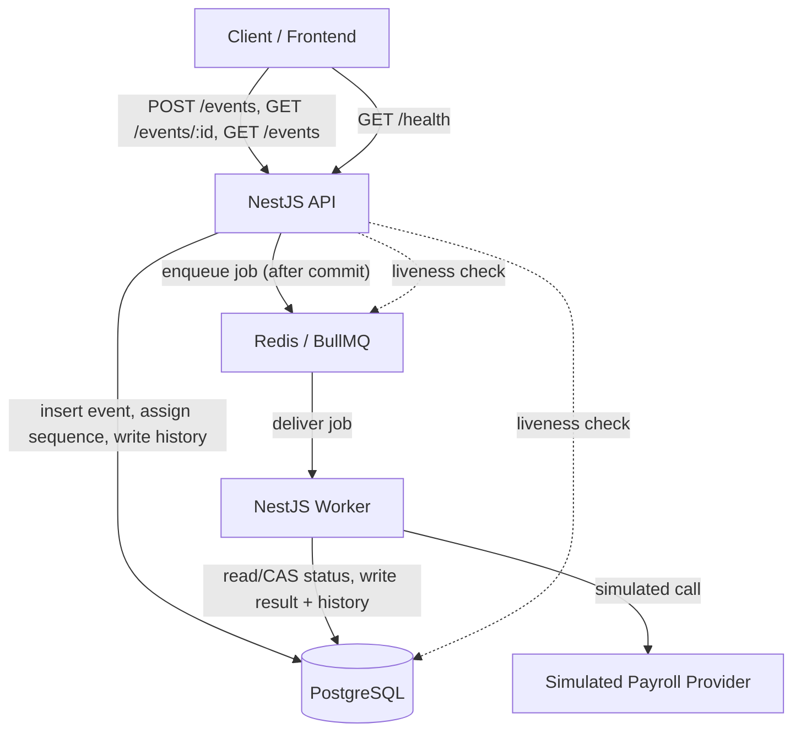
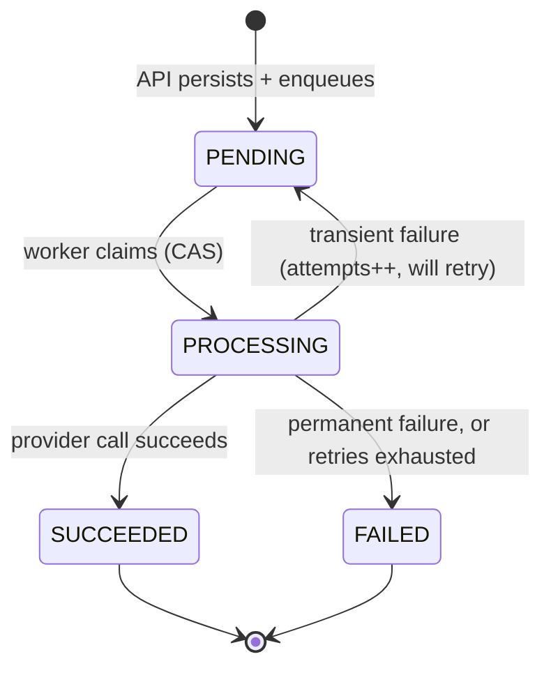
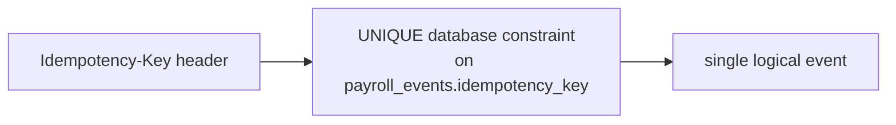
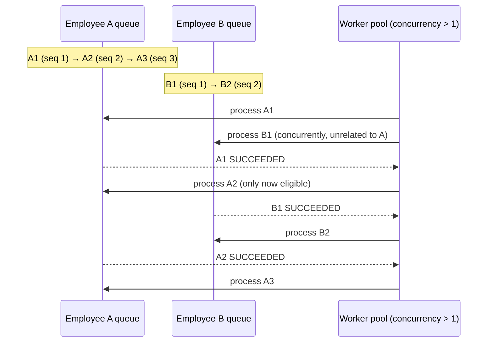
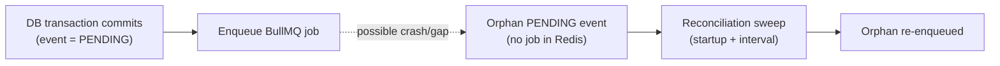
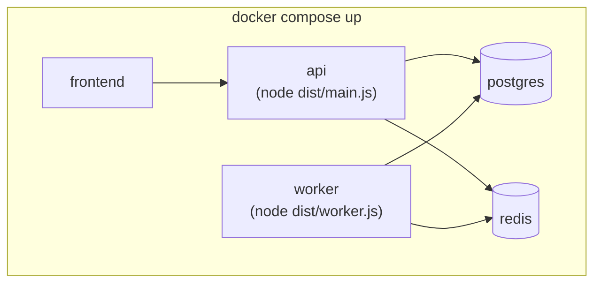

# Architecture

**Status:** Approved architectural contract. Implementation phases must follow this document
unless a change is explicitly proposed, reviewed, and merged back into it (see §27).

This document formalizes the architecture already analyzed and approved for the Payroll
Event Processing Service. It does not introduce new decisions — it records the ones already
made so every later implementation phase has a single, stable reference to build against.

---

## 1. Purpose and Scope

This document is the architectural contract for the Payroll Event Processing Service: a
NestJS + PostgreSQL + Redis/BullMQ backend that accepts payroll events (bank account
change, address change, salary change) over HTTP and processes them asynchronously against
a simulated external payroll provider, remaining correct under duplicate requests, retries,
worker crashes, and multiple concurrent workers, while preserving per-employee event order.

Scope: backend architecture, API design, database design (at the level of entities and
constraints — full schema detail lives in `docs/database-design.md`, written separately),
queue/worker design, Docker/CI architecture, and the minimal frontend's responsibilities.
Out of scope for this document: line-level code, the Prisma schema itself, and CI YAML
syntax — those are implementation artifacts that must conform to what's described here, not
restate it.

## 2. Assignment Requirements Relevant to Architecture

To keep design reasoning traceable, every constraint below is tagged by its source:

- **[REQ]** — an explicit requirement stated in `docs/assignment.md`.
- **[DECISION]** — a choice we made because the assignment leaves it to our judgment
  ("you may decide...", "you should decide...").
- **[PRACTICE]** — a general engineering practice applied because it's good practice, not
  because the assignment names it.

| Tag | Item |
|---|---|
| [REQ] | Node.js, TypeScript, NestJS, PostgreSQL, Redis, BullMQ, Docker/Compose, GitHub Actions |
| [REQ] | `POST /events`-style submission that does not hold the HTTP request open through processing |
| [REQ] | `GET /events/:id`-style retrieval exposing state, success/failure, result/failure detail |
| [REQ] | Asynchronous processing via Redis + BullMQ; simulated (not real) external provider |
| [REQ] | Temporary failures must not immediately become permanent; some failures never succeed |
| [REQ] | Duplicate HTTP submissions must not create duplicate business operations |
| [REQ] | Correctness with multiple worker processes; no accidental double-application |
| [REQ] | Worker crash must not leave an event permanently stuck |
| [REQ] | Named scenario: external call succeeds → DB write → crash before "done" → reprocessed → must not corrupt data or double-apply |
| [REQ] | Same-employee events process in acceptance order; different employees process concurrently; no unnecessary global serialization |
| [REQ] | Architecture must make adding new event types reasonably easy |
| [REQ] | Per-type validation; invalid input returns an appropriate response |
| [REQ] | Enough audit/history to reconstruct the event lifecycle |
| [REQ] | Automated tests covering 9 named scenarios (see §18) |
| [REQ] | `docker compose up` brings up API, worker, Postgres, Redis, frontend |
| [REQ] | GitHub Actions pipeline that would actually block a bad merge |
| [REQ] | README with install/env/Docker/DB/architecture/trade-offs + a simple diagram |
| [REQ] | Minimal frontend: submit, list, detail, result/failure visibility, observable state change |
| [DECISION] | Event state machine — states and transitions ("you should decide which states are necessary") |
| [DECISION] | Exact request/response structure for events (assignment explicitly allows redesign) |
| [DECISION] | Data model / audit implementation |
| [DECISION] | Depth of `/health` dependency checks |
| [DECISION] | Choice of Postgres data-access library (Prisma chosen) |
| [PRACTICE] | Structured logging, non-root Docker images, input validation, no transaction held across external I/O |

## 3. System Overview



| Component | Responsibility |
|---|---|
| **Client / Frontend** | Submits events, lists them, displays one event's status/result/failure detail. Talks only to the API — never to Postgres or Redis directly. |
| **NestJS API** | Validates requests, is the only writer of *new* events, assigns per-employee sequence, enforces idempotency, enqueues work, and serves read endpoints. Stateless — safe to run as multiple replicas. |
| **PostgreSQL** | The single source of durable, authoritative state. Every fact about an event (what it is, its current status, its result, its full history) lives here — never only in Redis/BullMQ. |
| **Redis / BullMQ** | The work queue. Holds *pending work*, not durable business state. If Redis were wiped, Postgres would still contain the truth about every event, just with some left un-reprocessed until reconciled (§15). |
| **NestJS Worker** | Consumes jobs, re-reads current state from Postgres (never trusts job payload as truth), performs the state transition, and records the outcome. Runs as a separate process from the API; can be scaled to multiple instances. |
| **Simulated Payroll Provider** | An in-process service standing in for a real external payroll system: adds latency, performs business validation, and occasionally raises transient or permanent failures — no real external integration. |

## 4. Repository Structure

```
payroll-event-processing-service/
├── backend/                  # NestJS API + worker (shared codebase, two entrypoints)
│   ├── src/
│   │   ├── main.ts           # HTTP entrypoint            [EXISTS]
│   │   ├── worker.ts         # BullMQ worker entrypoint    [Phase 5]
│   │   ├── app.module.ts     # [EXISTS — will import feature modules below]
│   │   ├── events/           # HTTP surface: DTOs, controller, service       [Phase 3]
│   │   ├── event-types/      # per-type validators + handler registry       [Phase 3/5]
│   │   ├── processing/       # BullMQ queue/worker/provider-sim/errors      [Phase 4/5/6/7]
│   │   ├── prisma/           # injectable Prisma client module              [Phase 2]
│   │   ├── health/           # GET /health                                 [Phase 4]
│   │   └── common/           # exception filters, logging setup            [Phase 3+]
│   ├── prisma/                # schema.prisma + migrations                 [Phase 2]
│   ├── test/                  # e2e/integration tests            [EXISTS, expands every phase]
│   ├── Dockerfile             # [EXISTS]
│   └── package.json           # [EXISTS]
├── frontend/                  # Minimal demonstration UI                    [Phase 8]
├── docs/
│   ├── assignment.md          # [EXISTS — authoritative, not modified]
│   ├── architecture.md        # this document
│   └── database-design.md     # detailed schema/constraints/indexes         [Phase 2]
├── docker-compose.yml          # postgres, redis, api, worker, frontend      [Phase 2/4/5/8]
└── .github/workflows/ci.yml    # [Phase 9]
```

`[EXISTS]` reflects the reviewed and pushed Phase 1 foundation. Everything else is planned,
not yet created, and must match this document when it is.

## 5. Backend Architecture

- **Application structure**: two entrypoints (`main.ts` for the HTTP API, `worker.ts` for the
  BullMQ consumer) sharing one `AppModule` composition of feature modules — not two separate
  applications, so business logic (validation, handler registry, error classification) is
  written once.
- **Modules**: `EventsModule` (API surface), `EventTypesModule` (per-type DTOs + handlers,
  the extensibility seam for §10), `ProcessingModule` (queue, worker processor, provider
  simulation), `PrismaModule` (DB client), `HealthModule`, `CommonModule` (cross-cutting
  filters/logging). None exist yet beyond the placeholder `AppModule`/`AppController`.
- **Controllers**: thin — validate via DTOs (framework-level `ValidationPipe`, already
  registered in `main.ts`), delegate to services, translate service-layer results/errors to
  HTTP responses. No business logic in controllers.
- **Services**: own transactions, idempotency handling, sequencing, enqueueing, and (in the
  worker) status transitions and provider invocation.
- **DTOs / validation**: one DTO per event type (`BankAccountChangeDto`, `AddressChangeDto`,
  `SalaryChangeDto`) validated via `class-validator`; `whitelist`/`forbidNonWhitelisted`
  already enabled globally so unknown fields are rejected, not silently dropped.
- **Configuration**: `@nestjs/config`, already wired globally in `AppModule`, reading from
  `.env` — no config values hardcoded once real modules land.
- **Error handling**: a global exception filter (`CommonModule`) maps domain errors
  (validation failure, not-found, unknown event type) to the correct HTTP status and a
  consistent JSON error shape; unexpected errors are caught and returned as a generic 500
  without leaking internals, and logged with full detail server-side.
- **Logging**: NestJS `Logger`, structured, at the lifecycle points named in the assignment
  (accepted, processing started/succeeded/failed, retry/recovery) — see §22.
- **Health checks**: `GET /health` checks Postgres and Redis connectivity — see §14 for what
  it does and does not detect.
- **Graceful shutdown**: Nest's built-in shutdown hooks enabled so the worker finishes or
  cleanly abandons (relying on BullMQ's lock/stall recovery) its current job rather than
  being hard-killed mid-write; the API stops accepting new connections before exiting.

No modules beyond the Phase-1 placeholder exist yet — this section documents the target
structure implementation phases must build toward, not current code.

## 6. API Architecture

| Endpoint | Responsibility |
|---|---|
| `POST /events` | Validate → assign idempotency/sequence → persist as `PENDING` → enqueue → return `202 Accepted` with `Location: /events/:id` |
| `GET /events/:id` | Return type, payload, current status, attempts, result/failure detail, status history |
| `GET /events` | List events (filter by `employeeId`/`status`, simple pagination) — required for the frontend's "view submitted events" |
| `GET /health` | Report Postgres/Redis liveness |

**Request/response lifecycle**: the HTTP request's job ends the moment the event is durably
persisted and enqueued — it never waits for processing to complete. This is why `POST
/events` returns `202`, not `200`/`201`: the resource is accepted, not yet finished.

**Idempotency-key handling**: clients supply an `Idempotency-Key` header per logical
submission attempt. See §10 for the full mechanism.

**HTTP status handling**: `202` accepted; `200` for successful reads; `400` for validation
failures and unknown event types; `404` for a missing event id; `409` reserved for any future
explicit conflict case (not currently used); `500` for unexpected server errors, logged with
full detail and returned to the client without internal detail.

**Error response strategy**: one consistent JSON error shape (`statusCode`, `message`,
`error`) across all failure cases, produced by the global exception filter, so client code
handles errors uniformly regardless of which layer raised them.

Endpoints are documented here for their contract; implementation (controllers/services/DTOs)
happens in Phase 3.

## 7. Database Architecture

PostgreSQL is the **single source of durable application state**. Redis/BullMQ holds
transient work state (queued jobs); if it were lost entirely, Postgres alone still describes
every event's truth, just with some events needing reconciliation (§15).

**Planned entities** (full column/constraint/index detail deferred to
`docs/database-design.md`, written in Phase 2):

- `payroll_events` — one row per submitted event: identity (`id`), business key
  (`employee_id`, `event_type`, `payload`), ordering (`sequence`), dedup
  (`idempotency_key`), lifecycle (`status`, `attempts`, `max_attempts`), outcome (`result`,
  `failure_reason`, `failure_type`), and timestamps (`submitted_at`,
  `processing_started_at`, `processing_finished_at`, `updated_at`).
- `event_status_history` — append-only audit trail: one row per state transition
  (`event_id` FK, `from_status`, `to_status`, `occurred_at`, `attempt_number`,
  `error_message`, `metadata`).

**Relationships**: one-to-many, `payroll_events` → `event_status_history`. Deliberately no
`employees` table — `employee_id` is an opaque external identifier; the assignment does not
ask us to manage employee records, and adding that entity would be unrequired scope.

**Important constraints** (rationale, detail in `database-design.md`): `UNIQUE
(idempotency_key)` is the idempotency mechanism's actual enforcement point (§10); `UNIQUE
(employee_id, sequence)` is the final, unconditional database-level invariant guaranteeing the
per-employee ordering counter can never hold a duplicate value for the same employee, no
matter what happens upstream of the constraint.

**Sequence-number allocation locking**: there is deliberately no `employees` table, so there is
no per-employee row available to take a row-level lock (e.g. `SELECT ... FOR UPDATE`) against
— that mechanism has no valid lock target here. Allocation instead uses a PostgreSQL
**transaction-level advisory lock**, acquired with `pg_advisory_xact_lock(key)` where `key` is
a deterministic hash of `employeeId` (e.g. via `hashtext(employeeId)`, cast/combined into the
64-bit key `pg_advisory_xact_lock` expects). The lock is scoped to the submission transaction
and released automatically on commit or rollback — no separate unlock call, and no dependency
on any row existing. Full mechanism and race-condition rationale in §12; this entry records
where it lives architecturally (a Postgres-native locking primitive, not an application-level
mutex, and not a row lock).

**Indexes**: on `(employee_id, sequence)` for the worker's ordering check, and on `(status)`
for list/ops queries — exact index set finalized against real query plans in Phase 2/6, not
guessed in advance.

**Transaction boundaries**: see §17 — three short, independent transactions per event
lifecycle (submit; start-processing; finish-processing), never one held open across the
external provider call.

Prisma schema and migrations are **not created in this phase** — this section is the
architectural contract they must implement, in Phase 2.

## 8. Event Lifecycle



Four states, deliberately no more:

| Transition | Performed by | Meaning |
|---|---|---|
| `[*] → PENDING` | API, inside the submission transaction | Event accepted, durably persisted, not yet claimed |
| `PENDING → PROCESSING` | Worker, via a compare-and-swap `UPDATE ... WHERE status='PENDING'` | Exactly one worker claims the job; a losing concurrent claim is a no-op, not an error |
| `PROCESSING → SUCCEEDED` | Worker, after the simulated provider call succeeds | Terminal — result is written in the same transaction |
| `PROCESSING → PENDING` | Worker, on a classified transient failure | Not terminal — `attempts` increments, BullMQ's backoff schedules the retry |
| `PROCESSING → FAILED` | Worker, on a classified permanent failure, or BullMQ exhausting the retry budget | Terminal — `failure_type` (`RETRYABLE` exhausted vs. `PERMANENT`) and `failure_reason` explain why |

**Invalid transitions** (e.g. `SUCCEEDED → PROCESSING`, or any transition not listed above)
are structurally prevented by the CAS guard: every worker-side write is conditioned on the
row's *current* status matching what that transition expects, so a redelivered or
concurrently-claimed job that no longer meets the precondition simply does nothing.

**Retryable vs. terminal**: `FAILED` is a single terminal state regardless of *why* —
whether a non-retryable business rejection or an exhausted retry budget. The distinguishing
detail (`failure_type`, `failure_reason`, `attempts`) lives in the row and in
`event_status_history`, not in a larger state enum. This is a deliberate simplification: fewer
states means fewer possible invalid-transition bugs, at the cost of the primary `status`
column alone not telling you *why* something failed — you need one more field for that,
which is judged an acceptable trade for this system's size.

**History recording**: every transition above is written to `event_status_history` in the
same transaction that changes `payroll_events.status` — this is what makes the full
lifecycle reconstructable for an investigating engineer (§12 of the assignment).

## 9. Queue Architecture

Asynchronous processing is used because the assignment requires it explicitly (§3) and
because it is the correct answer to the stated problem: the payroll operation is
"slow or unreliable," and the HTTP request must not stay open through it (§1/§17). Decoupling
submission from processing is what makes retries, worker crashes, and multi-worker scaling
all solvable independently of the request/response cycle.

- **Redis**: used exclusively as BullMQ's backing store — no ad-hoc caching, no separate
  pub/sub, no session storage.
- **BullMQ queue**: one queue, `payroll-events` — not one per event type, not one per
  employee (Step-by-step rationale in §12; a queue per employee is unbounded in the number of
  employees).
- **Producer**: the API, after its submission transaction commits (never inside it — Redis is
  not transactional with Postgres).
- **Job payload**: minimal, `{ eventId }`. The worker always re-reads current state from
  Postgres rather than trusting job data, so Postgres remains the single source of truth and
  the job can never go stale relative to it.
- **`jobId = eventId`**: BullMQ itself then refuses a second enqueue of the same event id — a
  cheap defense-in-depth layer under the DB-level idempotency constraint.
- **Worker concurrency**: configured via BullMQ's `concurrency` option (e.g. `5`), giving
  cross-employee parallelism "for free," with per-employee ordering enforced inside the
  processor (§12) rather than by limiting concurrency globally.
- **Job lifecycle**: `waiting → active → (completed | failed | delayed)`. `delayed` is used
  both for BullMQ's own retry backoff and, deliberately, for the ordering self-defer (§12) —
  a job the processor chooses to postpone without counting it as a failed attempt.

## 10. Idempotency Strategy



**Duplicate HTTP requests** (client retries after a network problem): the client supplies an
`Idempotency-Key` header per logical submission attempt. The API attempts to insert a new
`payroll_events` row with that key. If it succeeds, a new event exists. If it fails with a
Postgres unique-violation (`23505`), the API does **not** treat this as an error — it looks up
and returns the **already-existing** event under the same response shape, making the endpoint
safe to retry any number of times.

**Concurrent duplicate requests**: two identical retries arriving at the same or different API
instances at nearly the same instant is exactly the case a `UNIQUE` constraint is designed
for and an application-level "check, then insert" is not — the latter has a check-then-act
gap where both requests can pass the check before either commits. The implementation must
catch the constraint violation, not pre-check for existence, for this to actually be race-free.

**Duplicate queue delivery**: a distinct problem from HTTP-level duplication — a single,
already-unique event can still be delivered to a worker more than once (retry, stalled-job
reclamation, crash-recovery). This is handled by the concurrency strategy (§11), not by the
idempotency key — the two mechanisms solve different problems and must not be conflated.

**Why database uniqueness is the final authority**: it is the only participant in this system
that can atomically arbitrate "does this key already exist" under arbitrary concurrent
writers, including multiple API replicas with no shared in-memory state. An in-memory or
Redis-based "seen requests" set was considered and rejected — see §24.

## 11. Concurrency Strategy

Two independent layers, both required — neither alone is sufficient:

1. **BullMQ's own per-job lock**: the worker that picks up a job holds a Redis-backed lock,
   renewed while it runs. If that worker dies, the lock lapses and the job is reclaimed as
   *stalled*, up to a bounded number of times. This prevents the common case of two workers
   running the same job at once.
2. **Database compare-and-set on `status`**: the processor's first action is
   `UPDATE payroll_events SET status='PROCESSING', ... WHERE id=$1 AND status='PENDING'
   RETURNING *`. Only one such statement can ever affect the row; a second worker attempting
   the same update gets an empty result set and backs off cleanly — this is not treated as an
   error, it is the expected outcome of losing a race.

**Why only one worker may claim an event**: because the claim itself is a single atomic SQL
statement gated on the row's current status — there is no window in which two workers can
both believe they hold the claim, regardless of how many worker processes exist.

**Why this is needed in addition to BullMQ's lock**: BullMQ's lock can produce a false
positive — a worker that is alive and genuinely still processing (e.g. delayed by GC pause or
a slow simulated call) can have its lock lapse and be reclaimed by a second worker while the
first has not actually stopped. The database CAS is what makes that scenario safe: even if two
workers end up believing they should process the same event, only one of them can win the
status transition, and the loser simply exits.

**How unrelated employees process concurrently**: all locking here is scoped to a single
event id (the CAS) or a single employee's rows (the ordering check, §12) — never to the whole
table — so there is no reason for one employee's processing to block another's.

## 12. Per-Employee Ordering



Employee A's events (`A1 → A2 → A3`) must apply strictly in that order; Employee B's events
(`B1 → B2`) apply strictly in their own order; A and B proceed independently of each other.

**Mechanism**:
1. At submission time, inside the same transaction as the insert, the API first acquires a
   **PostgreSQL transaction-level advisory lock** keyed deterministically on `employeeId`
   (`pg_advisory_xact_lock(hashtext(employeeId))` or equivalent) — there is no `employees` row
   to take a row lock against (deliberately — §7), so the advisory lock is the mechanism that
   gives "lock scoped to one employee" a valid target without one. It then computes
   `sequenceNumber = MAX(sequence) + 1` for that `employeeId` and inserts the row. The lock is
   released automatically when the transaction commits or rolls back.
2. At processing time, before running business logic, the worker checks whether an
   earlier-`sequenceNumber` event for the same employee still exists in a non-terminal status.
   If so, the current job is not yet allowed to run.
3. Rather than failing (which would consume a retry attempt for no real error), the processor
   defers the job — reschedules it for a short time later through whatever mechanism the
   installed BullMQ version provides for a processor to voluntarily postpone a job without
   that counting as a failed attempt. The **architectural requirement** is the outcome: the
   job is retried shortly after at no cost to its retry budget. The specific BullMQ API call
   that achieves this is an implementation detail, verified against the installed BullMQ
   version in Phase 6, not fixed by this document.

**Race condition the advisory lock prevents, explicitly**: without a lock scoping sequence
allocation per employee, two concurrent submissions for the same employee could both execute
`SELECT MAX(sequence) FROM payroll_events WHERE employee_id = $1` before either has inserted —
both read the same maximum, both compute the same "next" sequence number, and both attempt to
insert it. `UNIQUE(employee_id, sequence)` (§7) stops this from silently corrupting order (one
insert is rejected), but the rejected request would then need an explicit retry-with-recompute
loop, and — more importantly — nothing would stop the *values* from being computed from a
stale read in the first place. `pg_advisory_xact_lock(employeeId)` closes this at the source:
the second concurrent submission for the same employee blocks until the first one's
transaction commits or rolls back, so the `MAX(sequence)` it reads is always genuinely current
for that employee. Submissions for *different* employees hash to different lock keys and never
contend — the lock's scope is exactly one employee, never the table.

**Race-condition protection for the processing side, explicitly**: the "is there an earlier
unfinished sibling" check and the eventual CAS to `PROCESSING` must be combined into the same
guarded database statement (e.g. `UPDATE ... WHERE status='PENDING' AND NOT EXISTS (earlier
non-terminal sibling)`), not performed as two separate steps. If done as two separate steps, a
narrow window opens where two same-employee jobs could both pass the ordering check moments
apart, before either has flipped status — combining them into one atomic statement closes
this. (This is a separate concern from the advisory lock above: the advisory lock protects
*sequence allocation* at submission time; this CAS protects *ordering enforcement* at
processing time.)

**Why not simpler alternatives**: a single worker with `concurrency: 1` is trivially ordered
but serializes unrelated employees too, which the assignment explicitly forbids. One BullMQ
queue per employee is unbounded in the number of employees. Throwing an ordering violation as
an error would burn the finite retry budget on a job that isn't actually broken — just early.

## 13. Retry and Backoff

The simulated provider raises one of two typed errors:

- **`TransientProviderError`** ("transient failure," "retryable failure"): left to propagate
  out of the processor uncaught. BullMQ's built-in `attempts` + exponential `backoff` retries
  it automatically. `payroll_events.status` returns to `PENDING` between attempts (the event
  is not "failing," it is "waiting to retry" — reflected honestly in its status). Once the
  configured attempt budget is exhausted, a `worker.on('failed', ...)` listener performs the
  final write: `status='FAILED'`, `failure_type='RETRYABLE'`, `failure_reason=<last error>`.
- **`PermanentProviderError`**: caught *inside* the processor immediately — written straight
  to `status='FAILED'`, `failure_type='PERMANENT'`, and the processor returns normally (does
  not re-throw), so BullMQ considers the job done and never retries something known to be
  futile.

**Maximum attempts** is a configured value (`max_attempts` stored per event, defaulted from
config) — the concrete number and backoff curve are implementation details of Phase 5, not
architectural decisions themselves; what's architecturally fixed is that the two failure kinds
are handled by two different code paths (throw-and-let-BullMQ-retry vs. catch-and-finish).

**Terminal failure**: `FAILED`, in both cases above — differentiated by `failure_type` and
`failure_reason`, not by a separate state (§8).

## 14. Worker Crash and Recovery

| Scenario | What happens | Recovery mechanism |
|---|---|---|
| Crash before processing (worker dies holding a job it hasn't touched yet) | Row is still `PENDING`, untouched | BullMQ's stalled-job reclamation redelivers it to another worker; indistinguishable from a first attempt |
| Crash during processing (mid external call, before any DB write) | Row is `PROCESSING`, no result written | Stalled-job reclamation redelivers; the redelivered attempt re-runs from `PROCESSING`, calling the provider again — safe because the provider is simulated/side-effect-free (§16) |
| Crash after DB state transition to a terminal status, before the job is acknowledged | Row is already `SUCCEEDED`/`FAILED` | Redelivered job re-reads the row, sees a terminal status, and exits as a no-op — no re-invocation of the provider, no duplicate write. This is the assignment's named §8 scenario. |
| Crash after external provider "success," before the finishing DB transaction commits | Row is still `PROCESSING` | Redelivery reprocesses from `PROCESSING`, including re-invoking the provider — see §16 for exactly what this does and does not guarantee |
| Redis unavailable | New submissions still persist to Postgres (durable), but cannot enqueue; existing in-flight jobs cannot be claimed | `/health` reports the outage; affected events remain `PENDING` and are picked up by the reconciliation sweep (§15) once Redis recovers |
| PostgreSQL unavailable | The API cannot accept new submissions (nothing durable to write); the worker cannot claim or finish jobs | `/health` reports the outage; once Postgres recovers, workers resume claiming as normal — no special-cased recovery logic needed, this is the same code path as a fresh start |

**Recovery strategy, summarized**: recovery is not a separate subsystem bolted on afterward —
it falls out of two things already true in normal operation: (1) BullMQ's stalled-job
reclamation, which requires no crash-specific code, and (2) the DB CAS/no-op guard, which
makes redelivery of an already-terminal event safe by construction. The one gap neither of
these covers — the DB-commit/enqueue gap — is handled explicitly in §15.

## 15. DB Commit → Queue Enqueue Gap



The submission transaction (Postgres) and the enqueue call (Redis) are two separate systems
with no shared transaction — there is an unavoidable, narrow window where the DB commit
succeeds but the subsequent enqueue call fails (process crash between the two, or a Redis
blip), leaving a `PENDING` row with no corresponding job.

**Approved approach**: a lightweight periodic reconciliation sweep (run on worker startup and
on a fixed interval) queries Postgres — the only system it needs to inspect — for `PENDING`
events older than a short threshold, and attempts to enqueue each one using `jobId = eventId`
(the same defense-in-depth already established in §9). The sweep does **not** need to inspect
Redis/BullMQ state to decide whether a job "already exists" for a given event:

- If an active/waiting/delayed job with that `jobId` is still present, BullMQ's own job-id
  deduplication rejects the redundant enqueue attempt — the sweep simply ignores that outcome
  and moves on.
- If no job with that `jobId` currently exists (the original enqueue never happened, or a
  prior job already completed and was removed), the enqueue succeeds and the event is picked
  up normally.
- If a job *did* already run to completion and the event is therefore no longer actually
  `PENDING`, this re-enqueue attempt cannot happen in the first place — the sweep's query is
  against Postgres's current `status`, which BullMQ's own state has no bearing on.

This keeps the sweep a single, simple Postgres query plus a best-effort enqueue call, with no
requirement to reconcile Redis/BullMQ's internal state against Postgres's. Correctness does
not depend on the sweep getting the "does a job already exist" question right — it depends on
the worker/database idempotency mechanisms already established in §8/§11 (the CAS guard and
the terminal-status no-op check), which make re-enqueuing an event that was already processed,
or is already queued, harmless regardless of what the sweep does. The sweep only needs to be
*effective* (orphaned events eventually get another attempt), not *precise*.

**Explicitly not built**: a full transactional outbox or CDC-based pipeline (e.g. an
outbox table plus Debezium/log-shipping into Redis) — the textbook fully-correct answer to
this class of problem. It is intentionally not introduced here because of this assignment's
scope and time-box: the reconciliation sweep above closes the same gap adequately, is a
fraction of the engineering cost, and is easy to explain and verify, whereas a full outbox/CDC
pipeline would be disproportionate machinery for a service of this size. This is a deliberate,
accepted trade-off, not an oversight.

## 16. External Payroll Provider

The provider is **simulated** — an in-process service, not a real integration (explicitly
excluded by the assignment). It:

- is fully deterministic — no simulated latency, no randomness
  (`simulated-payroll-provider.ts`);
- performs basic business validation on the event payload;
- raises `TransientProviderError` at a configurable random rate (manual demoing) **and**
  supports deterministic failure injection via a reserved marker value (automated tests must
  never depend on random chance);
- raises `PermanentProviderError` similarly;
- otherwise returns a success result that is persisted verbatim.

**Idempotency implications, stated precisely**: the provider call itself is **at-least-once**,
not exactly-once — in the specific crash window described in §14 ("crash after provider
success, before the finishing transaction commits"), the provider can be invoked more than
once for the same event. This is safe here *only* because the simulated provider is
deterministic and has no side effect outside our own Postgres — recomputing/reapplying is
harmless by construction. It would **not** be automatically safe against a real external
system unless that system were also idempotent per event id (e.g. accepting our `event.id` as
its own dedup key) — a limitation to state plainly, not one this design claims to solve.

**What is actually guaranteed, without overclaiming**: the durable business state transition
in Postgres (an event moving from a non-terminal to a terminal status, with its result) is
enforced to happen **at most once**, because that transition is gated by an atomic
compare-and-set. Nothing in this architecture provides universal exactly-once processing, and
no part of this document should be read as claiming it does.

**Retry implications**: transient provider failures are retried per §13; permanent ones are
not retried at all, regardless of how many attempts remain.

## 17. Transaction Boundaries

| Phase | Transaction scope | External call inside it? |
|---|---|---|
| Submission | Idempotency check/insert + per-employee advisory lock (§7/§12) + sequence computation + `payroll_events` insert + `event_status_history` insert | No — enqueue happens after commit |
| Processing start | CAS `PENDING → PROCESSING` + history row | No |
| *(between transactions)* | — | **Yes** — the simulated provider call happens here, outside any transaction |
| Processing finish | CAS `PROCESSING → SUCCEEDED\|FAILED` (guarded by `WHERE status='PROCESSING'`) + result + history row | No |

**Why external calls must never be made while holding a database transaction**: a database
transaction holds row (and potentially table-level) locks and occupies a connection from the
pool for its entire duration. The simulated provider is deliberately slow and unreliable (by
design, 200ms–2s and occasionally failing); holding a transaction open across that call would
mean a single slow or hanging external call ties up a database connection and any locks it
holds for that entire time. Under concurrent processing (`concurrency > 1`), this starves the
connection pool and can serialize unrelated work — precisely the kind of unnecessary
bottleneck §9 of the assignment warns against. Keeping transactions short and bounded to a
single fast round-trip, with the slow call happening entirely between two of them, avoids this
regardless of how unreliable the external system is.

## 18. Testing Architecture

| Tier | What it covers | Example |
|---|---|---|
| **Unit** | Pure logic, no I/O | DTO validation per event type; error classification (transient vs. permanent); ordering-check predicate in isolation; the defer-path never incrementing `attempts` |
| **Integration** | Real Postgres (and, where relevant, real Redis/BullMQ), no HTTP | Idempotency race (concurrent inserts, same key → one row); sequence assignment race for one employee; CAS guard rejecting a redelivered already-terminal job |
| **Functional / E2E** | Supertest against a fully bootstrapped app (and, for full-lifecycle cases, a real worker) | `POST /events` happy path (202+Location); invalid payload (400); unknown event type (400); missing id (404); full lifecycle to a terminal state |
| **Concurrency tests** | Multiple workers/`concurrency>1` against shared state | Two workers racing to claim one job — only one succeeds; two different employees' events processing with overlapping wall-clock time |
| **Ordering tests** | Per-employee sequencing | Address-then-salary for one employee processed in that order; unaffected by another employee's events interleaved in the queue |
| **Idempotency tests** | Duplicate-key handling | Concurrent identical `POST /events` → one row, both responses reference the same event |
| **Retry tests** | Transient failure handling | Deterministic transient injection → eventual success or exhausted-and-`FAILED`/`RETRYABLE` |
| **Recovery tests** | §8's named scenario | Pre-seed a terminal-status row, re-invoke the processor directly, assert no-op (provider not called, no new history row, no duplicate write) |
| **Failure injection** | Deterministic, not random, in automated tests | A reserved marker value in the payload forces a specific provider outcome, so CI is never flaky; the random-rate configuration is reserved for manual demoing only |

Test tier classification (unit vs. integration vs. functional vs. e2e) follows the definitions
above and must be defensible in the technical review, per the assignment's explicit request.

## 19. Frontend Architecture

Kept intentionally minimal, covering only what the assignment requires — no more:

- **Submit** — one form, fields switch based on the selected event type, posts to the API.
- **List** — table of submitted events (id, employee, type, status, submitted time), refreshed
  by polling every few seconds so state changes are visibly observable without adding
  WebSockets/SSE infrastructure the assignment does not ask for.
- **Detail** — one event's payload, current status, attempts, result/failure detail, and its
  status-history as a simple timeline.

No authentication, no admin views, no styling investment beyond clarity, no state-management
library, no routing beyond what's needed for these three views. The frontend consumes the real
backend — it is not a mocked standalone demo.

## 20. Docker Architecture



- **One backend Docker image**, built once (multi-stage, already written in Phase 1), reused
  for **both** the `api` and `worker` Compose services via a `command:` override
  (`node dist/main.js` vs. `node dist/worker.js`) — not two separate Dockerfiles, since the
  two entrypoints share the same compiled application code.
- **postgres** and **redis** — standard images, each with a named volume for local data
  persistence across restarts.
- **frontend** — a small static build served by a lightweight server, its own container.
- **Networking**: Compose's default network; services address each other by service name
  (`postgres`, `redis`) rather than `localhost`.
- **Environment configuration**: `.env` (git-ignored) populated from the committed
  `.env.example`; each service receives only the variables it needs.
- **Health checks**: Compose-level health checks on `postgres`/`redis` so `api`/`worker` don't
  start racing against a database that isn't ready yet; the API's own `GET /health` is the
  application-level equivalent, checked externally (e.g. by a person, or CI) rather than by
  Compose itself.

## 21. CI/CD Architecture

Staged GitHub Actions pipeline, each stage gating the next:

1. **Install** — dependency install (cached).
2. **Lint** — `eslint --max-warnings 0`.
3. **Typecheck** — `tsc --noEmit`.
4. **Unit tests** — no external services required.
5. **Integration / E2E tests** — run against Postgres + Redis GitHub Actions service
   containers, migrations applied first.
6. **Build** — `nest build`, plus a Docker build for the backend image (and the frontend
   build) to catch build-breaking errors CI would otherwise miss.

Runs on pull requests and pushes to `main`/`development`. No deploy stage — no deployment
target exists for this assignment; CI's stated purpose is to block bad merges, not to ship
anywhere.

## 22. Observability

- **Structured logs** at the exact lifecycle points the assignment names: event accepted,
  processing started, processing succeeded, processing failed (with retryable/permanent
  distinction), retry scheduled, stalled/recovered.
- **Identifiers**: every relevant log line includes the event id, employee id, and event type,
  so a single event's full processing history can be traced across API and worker logs by
  grepping one id. BullMQ job ids are set equal to event ids (§9), so queue-side logs
  correlate directly too.
- **Worker logs**: claim attempts (including CAS losses, logged at low severity as expected
  outcomes, not errors), provider call outcomes, final state transitions.
- **Failure logging**: every `FAILED` transition logs its `failure_type` and `failure_reason`
  at a severity appropriate to whether it's expected (business rejection) or worth attention
  (retries exhausted, unexpected error type).
- **Health checks**: `GET /health` — see §5/§14/§20.
- **Queue visibility**: BullMQ's own tooling (e.g. Bull Board, or direct Redis inspection) is
  sufficient for local/demo visibility into queue depth and job states — no bespoke queue
  dashboard is built.

## 23. Security

- **Input validation**: `class-validator` DTOs, `whitelist`/`forbidNonWhitelisted` enabled
  globally — malformed or unexpected fields are rejected, not silently accepted.
- **Secrets/environment variables**: all configuration (DB URL, Redis host, provider
  failure-rate knobs) via env vars, never hardcoded; `.env` is git-ignored, `.env.example`
  documents every variable without real values.
- **Sensitive data handling**: IBAN and similarly sensitive fields are masked in logs (e.g.
  last four characters only) — a proportionate, low-cost realism touch, not a compliance
  system.
- **Logging safety**: no full request/response bodies logged verbatim where they might contain
  sensitive payload fields; structured logs carry identifiers and status, not raw payloads.
- **Dependency security**: standard `npm audit` awareness; no dependency pinned to a version
  with a known-exploitable, applicable vulnerability at time of adding.
- **Least privilege**: Docker images run as a non-root user (already implemented in the
  Phase-1 `Dockerfile`); the database user used by the app should be scoped to only the schema
  it needs, not a superuser, when deployed beyond local Compose.
- **CORS**: enabled, scoped to the frontend's origin.
- **Authentication**: explicitly **not** implemented — out of scope per the assignment ("What
  Is Not Required"), stated here plainly rather than left ambiguous.
- **Rate limiting**: implemented on `POST /events` only (`@nestjs/throttler`, IP-based, 60
  requests per rolling 60-second window) — abuse protection at the HTTP edge, unrelated to and
  independent of the retry/backoff/ordering/reconciliation mechanisms described elsewhere in
  this document. Not applied to `GET /events`, `GET /events/:id`, or `/health`.

## 24. Important Architectural Decisions

| Decision | Chosen Approach | Why | Alternative | Trade-off |
|---|---|---|---|---|
| Backend framework | NestJS | Required by the assignment; DI + module system fits the extensibility requirement well | — | N/A, mandated |
| Database | PostgreSQL | Required; also the natural fit for durable, constraint-enforced state | — | N/A, mandated |
| Data-access library | Prisma | Best migration ergonomics and typed client for the assignment's time-box; assignment explicitly allows this choice | TypeORM, Drizzle | Prisma's migration engine is less flexible for very advanced schema patterns — irrelevant at this schema's size |
| Queue | Redis + BullMQ | Required | — | N/A, mandated |
| Idempotency enforcement | DB-backed `UNIQUE` constraint on `idempotency_key`, insert + catch-violation | Only mechanism that's race-free under multiple API replicas with no shared memory | In-memory or Redis "seen requests" set | Requires the client to supply a key; without it, dedup falls back to no protection — an explicit API contract, documented |
| Multi-worker safety | Database CAS (`UPDATE ... WHERE status=<expected>`) layered under BullMQ's own job lock | Closes the residual stalled-job-false-positive gap BullMQ's lock alone doesn't guarantee | Redlock-style distributed mutex | Adds a second locking system with its own well-known correctness caveats, for no benefit over a mechanism Postgres already provides |
| Per-employee ordering | `sequence` column allocated under a `pg_advisory_xact_lock` keyed on `employeeId`, enforced at processing time by a worker-side check-and-defer (exact defer mechanism decided in Phase 6) | Anchors ordering in the durable store; keeps cross-employee concurrency; the advisory lock gives sequence allocation a valid per-employee lock target with no `employees` table to lock a row against | Single global worker (`concurrency:1`); one queue per employee; BullMQ Pro job groups; row lock against a dedicated `employees` table | Global worker violates the no-unnecessary-serialization requirement; per-employee queues are unbounded; Pro job groups aren't available on OSS; adding an `employees` table purely to have a lock target is unrequired scope (§25) |
| DB-commit/enqueue gap | Lightweight reconciliation sweep: Postgres-only query + best-effort re-enqueue via `jobId = eventId`, relying on BullMQ's own job-id dedup plus worker/DB idempotency (§8/§11) for safety — no Redis/BullMQ state inspection required | Adequate, cheap, explainable fix for a narrow window; does not need to be precise, only effective, because downstream idempotency already makes a redundant re-enqueue harmless | Full transactional outbox / CDC pipeline; a sweep that inspects Redis/BullMQ queue state directly | Outbox/CDC is the textbook fully-correct answer but disproportionate machinery for this assignment's scope; inspecting queue state directly would couple the sweep to BullMQ's internal job-state API for no added safety over what jobId dedup + DB idempotency already provide |
| Docker images | One shared backend image, `command:` override for `api` vs. `worker` | Both entrypoints share the same compiled code; avoids maintaining two near-identical Dockerfiles | Two separate Dockerfiles/images | None meaningful — purely simpler to maintain |
| Employee data | No `employees` table; `employeeId` stays an opaque string | Assignment never asks us to manage employee records; adding one is unrequired scope | A minimal `employees` table with FK integrity | Loses referential integrity on `employee_id` — accepted, since the assignment scopes this out explicitly |
| Frontend | Minimal React + Vite + TS, 3 views, polling for state updates | Meets the assignment's 5 named frontend requirements exactly, nothing more | WebSockets/SSE for live updates; a heavier framework/state library | Polling has slight latency to reflect state changes vs. push — acceptable given "Medium importance" weighting and no such requirement stated |
| Overall backend topology | One NestJS codebase, two entrypoints (API, worker) — not microservices | The problem (one bounded domain: payroll events) doesn't need service boundaries; a monolith-with-two-entrypoints is simpler to build, test, and reason about within the time-box | Separate API/worker services or a broader microservice split | Microservices would add deployment/operational complexity with no corresponding benefit at this scope |

## 25. Explicitly Out of Scope

The following are intentionally **not** built, unless the assignment is later found to require
them:

- Kubernetes or any orchestration platform beyond Docker Compose.
- Kafka or any event-streaming platform — BullMQ/Redis is the mandated and sufficient queue.
- A microservices split beyond the API/worker two-entrypoint model.
- A full transactional outbox or CDC pipeline (§15) — a lightweight reconciliation sweep is
  used instead.
- Authentication, authorization, user registration, or an admin dashboard.
- An `employees` table or any HR-system-adjacent domain modeling.
- Advanced frontend architecture: state-management libraries, WebSockets/SSE, complex routing,
  visual design investment beyond clarity.
- Complex cloud infrastructure of any kind — this system's deployment target is local Docker
  Compose only.
- Real integration with any external payroll provider.

## 26. Implementation Phase Mapping

| Phase | Architectural component implemented |
|---|---|
| **Phase 1** | Foundation — Nest app skeleton, tooling (lint/typecheck/test), base Docker image, `.env.example`. *(Complete, reviewed, pushed to `development`.)* |
| **Phase 2** | Database — `payroll_events` + `event_status_history` schema and migrations (§7), `PrismaModule`; `docker-compose.yml` gains `postgres`. Detailed in `docs/database-design.md`. |
| **Phase 3** | Submission API — `EventsModule`, per-type DTOs/validation, idempotency handling (§10), sequence assignment (§12, submission half), `GET` endpoints (§6). |
| **Phase 4** | Queue integration — BullMQ wiring, enqueue-after-commit (§9), `HealthModule` (§6/§14/§20); Compose gains `redis`. |
| **Phase 5** | Worker — `worker.ts`, event-type handler registry, simulated provider (§16), CAS state transitions (§8/§11), retry/backoff classification (§13); Compose gains `worker`. |
| **Phase 6** | Ordering enforcement — the check-and-defer logic in §12, layered onto Phase 5's processor. |
| **Phase 7** | Recovery — the no-op redelivery guard's test coverage, stalled-job tuning, the reconciliation sweep (§15). |
| **Phase 8** | Frontend (§19); Compose gains `frontend`. |
| **Phase 9** | CI pipeline (§21). |
| **Phase 10** | Documentation and submission polish — full README, this document kept current, final submission-checklist pass. |

## 27. Architecture Change Policy

Any change to the architecture described in this document — a new data-access library, a
different queue technology, a different state machine, a different ordering mechanism, or any
other structural decision — must, before implementation:

1. **Identify the reason** the currently approved approach is insufficient or wrong.
2. **Explain the impact** on the components, guarantees, and trade-offs described above.
3. **Update this document** (`docs/architecture.md`) to reflect the new decision, including
   updating the relevant decision-table row in §24 rather than deleting its history.
4. **Be reviewed and approved** before any corresponding code is written.

No implementation phase may silently diverge from this document. If a phase's implementation
reveals that something here needs to change, that is itself a signal to pause and go through
the steps above, not to proceed and reconcile the document afterward.
