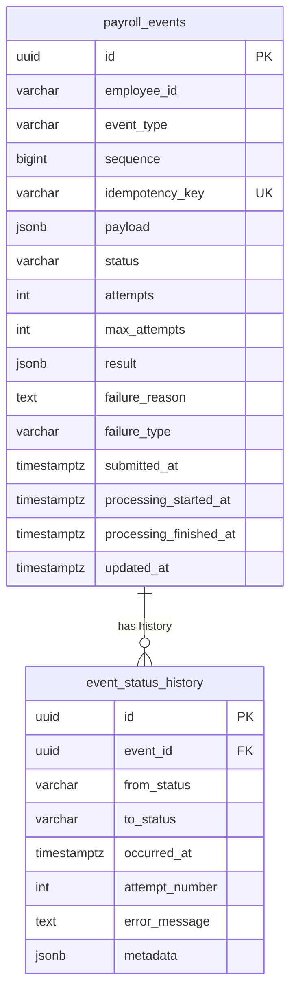

# Database Design

**Status:** Detailed database design for the Payroll Event Processing Service, written under
`docs/architecture.md` (§7 explicitly defers this level of detail here) and `docs/assignment.md`.
Nothing in this document introduces an entity, field, relationship, or infrastructure piece
that isn't already justified by those two documents. Genuinely open points are marked
**[OPEN QUESTION]** rather than resolved by invention.

> **Note on source verification**: `docs/architecture.md` is not present in this branch's
> working tree (`feature/database-design` was branched before the architecture-doc commit was
> merged). It was read in full via `git show origin/feature/architecture-doc:docs/architecture.md`
> — a read-only operation — to ground this document, without checking out or merging anything
> into this branch. Flagging this so the branch discrepancy is visible, not silently worked
> around.

---

## 1. Database Design Overview

PostgreSQL is the **single source of durable application state** for this system (architecture
§7). Every fact that must survive a process restart, a Redis flush, or a worker crash lives in
PostgreSQL — nothing about an event's identity, current status, result, or history is allowed
to exist *only* in Redis/BullMQ.

**What must be durable**: the event itself (what was submitted, for which employee, of which
type), its current processing state, its outcome (result or failure detail), and a complete
record of how it got there (§8, §12 of the assignment — traceability).

**Why PostgreSQL is the source of truth, not Redis/BullMQ**: Redis/BullMQ's job is to schedule
and deliver *work* — it answers "what should a worker do next," not "what is true about this
event." A BullMQ job can be redelivered, can stall, can be reclaimed, or (in a crash scenario)
can simply vanish before its outcome is recorded anywhere queue-side. None of that is
acceptable for a business fact. Postgres transactions and constraints give the atomicity and
durability guarantees (§11, §12, §13 of the architecture) that Redis's job-lifecycle
bookkeeping does not.

**What Redis/BullMQ does NOT own**: it does not own the event's status, its result, its
history, or its identity for idempotency purposes. It owns exactly one thing: "there is
pending work for event X, to be delivered to a worker." If every Redis key were lost right
now, every event's true state would still be fully readable from Postgres — some events would
simply be waiting for the reconciliation sweep (architecture §15) to be re-enqueued, which is
a recoverable, expected condition, not data loss.

## 2. Entity Overview

Exactly two tables, matching architecture §7's "Planned entities" list precisely — no more:

| Entity | Purpose | Why it exists | Relationship |
|---|---|---|---|
| `payroll_events` | One row per submitted payroll event: its identity, business data, ordering position, current lifecycle state, and outcome. | This *is* the event — the API's write target on submission, the worker's read/write target during processing, and the API's read target for `GET /events(/:id)`. | Parent side of a one-to-many relationship to `event_status_history`. |
| `event_status_history` | One row per state transition a `payroll_events` row goes through. | Append-only audit trail — the assignment's §12 traceability requirement ("store enough information to understand the important lifecycle of an event") is satisfied by this table specifically, not by the primary row alone. | Child side; every row references exactly one `payroll_events` row. |

No `employees` table is introduced (architecture §7/§25, explicitly). No event-type-specific
tables (e.g. a separate `bank_account_changes` table) are introduced either — see §4 and §19
for why a single polymorphic table with a `payload` column is used instead, which is what
keeps adding a new event type a data-only change (architecture §5/§7, assignment §10).

## 3. ER Diagram



Mermaid's ER notation only annotates single-column keys (`PK`/`FK`/`UK`), so the composite
`UNIQUE(employee_id, sequence)` constraint cannot be drawn as a per-column tag here without
misrepresenting it as two independent unique columns, which it is not. It is documented fully,
with its own rationale, in §7 and §9 below. Every other element of this diagram — both
entities, every column, both keys shown, and the one relationship — matches the written
schema in §4–§6 exactly.

## 4. `payroll_events` Table

| Column | Type | Nullable | Default | Purpose |
|---|---|---|---|---|
| `id` | `uuid` | NOT NULL | generated (`gen_random_uuid()` or app-generated) | Primary key; the event's identity, referenced by the API path (`GET /events/:id`), by the BullMQ `jobId` (architecture §9), and by `event_status_history.event_id`. |
| `employee_id` | `varchar` | NOT NULL | — | Opaque external identifier for the employee this event concerns. Not a foreign key — there is deliberately no `employees` table (§6). The unit that all ordering (§9, §12) and sequence allocation is scoped to. |
| `event_type` | `varchar` | NOT NULL | — | Which of `BANK_ACCOUNT_CHANGE` / `ADDRESS_CHANGE` / `SALARY_CHANGE` (or a future type) this is. Plain `varchar`, not a native Postgres `ENUM`, and with no `CHECK` constraint restricting its value set — this is the specific column the assignment's extensibility requirement (§10) and the architecture's extensibility rationale (§5/§7) are about: adding `TAX_CLASS_CHANGE` later must not require a schema migration to widen an enum or a check constraint. |
| `sequence` | `bigint` | NOT NULL | — | This event's position in submission order *for this employee* (architecture §12). Combined with `employee_id`, this is what per-employee ordering is built on. Allocated under an advisory lock — see §9. |
| `idempotency_key` | `varchar` | NOT NULL | — | Client-supplied key identifying "this logical submission attempt" (architecture §10). The actual enforcement point of the idempotency mechanism is the `UNIQUE` constraint on this column (§7), not application logic. |
| `payload` | `jsonb` | NOT NULL | — | The event-type-specific business fields (IBAN, address fields, salary/currency, `effectiveDate`, etc. — assignment §"Supported Event Types"). `jsonb` rather than per-type dedicated columns or a per-type table, precisely so a new event type is a new DTO + handler (architecture §5's `EventTypesModule`), not a new migration. Internal shape is validated at the application layer (`class-validator` DTOs per type), not by a database constraint — see §16 for why. |
| `status` | `varchar` | NOT NULL | `'PENDING'` | Current lifecycle state — one of `PENDING`, `PROCESSING`, `SUCCEEDED`, `FAILED` (architecture §8; full model in §11 below). Plain `varchar`, like `event_type`, with **no database-level `CHECK` constraint** — the architecture's approved convention (architecture §7) is `varchar` plus application-layer validation for both columns, not native `ENUM` types or additional schema-level value-set constraints. Validity of the four-value set is enforced entirely by the application and by the CAS-guarded transition logic (§11/§13): every worker-side write is conditioned on the row's current status matching what a given transition expects, so no code path in the approved design ever writes a value outside the four states. See §7 for the full rationale. |
| `attempts` | `int` | NOT NULL | `0` | Number of processing attempts made so far. Incremented on each `PENDING → PROCESSING` claim (architecture §8's transition table). Used to reason about "waiting to retry" vs. "exhausted." |
| `max_attempts` | `int` | NOT NULL | — (app-supplied at insert time) | The attempt budget for this event, from configuration at submission time. **[OPEN QUESTION]**: the concrete default number and backoff curve are explicitly left to Phase 5 implementation by architecture §13 ("implementation details of Phase 5, not architectural decisions themselves") — this document does not invent a number. No DB-level `DEFAULT` is set for this reason; the application populates it from config on every insert. |
| `result` | `jsonb` | NULL | — | The simulated provider's success payload, once `status = 'SUCCEEDED'`. `NULL` until then. |
| `failure_reason` | `text` | NULL | — | Human-readable explanation once `status = 'FAILED'` — what an investigating engineer reads (assignment §4/§12). `NULL` while not terminal-failed. |
| `failure_type` | `varchar` | NULL | — | `RETRYABLE` (retries were exhausted) or `PERMANENT` (a non-retryable business rejection) — the detail that lets one terminal `FAILED` status still answer "why" (architecture §8/§13). `NULL` unless `status = 'FAILED'`; this correlation is an application-enforced invariant, not a DB constraint (§7 explains why no cross-column `CHECK` is added for it). |
| `submitted_at` | `timestamptz` | NOT NULL | `now()` | When the API accepted and durably persisted the event. This *is* the creation timestamp — no separate `created_at` column, since the assignment's audit requirement (§12) is specifically about the processing lifecycle, and `submitted_at` already marks the start of it. |
| `processing_started_at` | `timestamptz` | NULL | — | Set on the first successful `PENDING → PROCESSING` claim. `NULL` until a worker has claimed the event at least once. |
| `processing_finished_at` | `timestamptz` | NULL | — | Set when the event reaches a terminal status (`SUCCEEDED` or `FAILED`). `NULL` until then. |
| `updated_at` | `timestamptz` | NOT NULL | `now()` | Last time this row changed, in any way. Set by the application on every write (not a DB trigger — see §16 for why no trigger is introduced). |

No field beyond this list is added. In particular: no `created_by`/`updated_by` (no auth
exists — assignment "What Is Not Required"), no soft-delete column (nothing in the assignment
or architecture calls for deleting events), no denormalized employee name/details (there is no
employee entity to denormalize from), no separate `version` column for optimistic locking (the
CAS pattern in §13 uses `status` itself as the guard condition, which is sufficient here and
covered in architecture §11 — a separate version counter would be redundant).

## 5. `event_status_history` Table

| Column | Type | Nullable | Default | Purpose |
|---|---|---|---|---|
| `id` | `uuid` | NOT NULL | generated | Primary key of the history row itself. |
| `event_id` | `uuid` | NOT NULL | — | Foreign key to `payroll_events.id` — which event this transition belongs to. |
| `from_status` | `varchar` | NULL | — | The status before this transition. `NULL` for the very first row of an event's history (its creation into `PENDING` has no "from" state). |
| `to_status` | `varchar` | NOT NULL | — | The status after this transition. |
| `occurred_at` | `timestamptz` | NOT NULL | `now()` | When this transition happened — what makes the lifecycle reconstructable in order. |
| `attempt_number` | `int` | NULL | — | Which attempt this transition corresponds to. `NULL` for the initial creation row (no attempt has started yet); set for every processing-related transition thereafter. |
| `error_message` | `text` | NULL | — | Populated for transitions into `PENDING` (retry) or `FAILED` (terminal failure) with the underlying error detail; `NULL` for transitions that aren't failure-related (e.g. the initial creation, or `PROCESSING → SUCCEEDED`). |
| `metadata` | `jsonb` | NULL | — | A small, deliberately open-ended field for anything else worth recording about a transition (e.g. which worker instance performed it, for local debugging) without needing a schema change for every new detail. Not required by the assignment; included because architecture §7 explicitly lists it as part of this table, and it costs nothing structurally. No `actor`/`source` column beyond what fits here — there is no multi-actor/multi-tenant concept in this system (no auth, single worker codebase), so a dedicated actor column would be unjustified structure; if a specific detail (e.g. worker instance id) is ever needed as a first-class queryable field rather than free-form metadata, that is a candidate for a future, explicitly-approved column, not one added silently here. |

**Why append-only**: rows in this table are never updated or deleted — only inserted. Each
state transition, including a retry that returns the parent row to `PENDING`, produces a new
row. This is what makes the table a *trail* rather than a snapshot: it must be possible to
answer "what happened, in what order, including every retry" (assignment §12) after the fact,
which an update-in-place history table cannot do. It also means `event_status_history` never
participates in the concurrency-control mechanisms in §13 — nothing ever contends for a
specific history row, only for inserting a new one, which is a simple append and needs no
locking beyond the transaction it's written in.

## 6. Relationships

- **Primary keys**: `payroll_events.id` (`uuid`), `event_status_history.id` (`uuid`).
- **Foreign key**: `event_status_history.event_id → payroll_events.id`.
- **Cardinality**: one `payroll_events` row to many `event_status_history` rows (1:N). Every
  `payroll_events` row has at least one history row (the creation transition into `PENDING`,
  written in the same transaction as the insert — architecture §8/§17).
- **Delete behavior**: no `ON DELETE` action is specified — Postgres's default, `NO ACTION`,
  applies (equivalent to `RESTRICT` for this schema's purposes, since nothing here uses
  deferred constraint checking). Deleting a `payroll_events` row that still has
  `event_status_history` rows referencing it is **rejected** by the foreign key, not
  cascaded. **`ON UPDATE`** likewise needs no explicit action, since the referenced key (`id`)
  is an immutable `uuid`, never updated in place.
- **Why not `ON DELETE CASCADE`**: `event_status_history` *is* the audit trail — silently
  deleting an event's entire history the moment its parent row is deleted is the opposite of
  what an audit trail is for. There is also no delete path anywhere in this system's own API
  (nothing in the assignment or architecture defines an endpoint or process that deletes
  events), so this decision only matters for an exceptional, manual/operator-driven deletion —
  and for exactly that case, failing loudly (forcing whoever is deleting the event to
  explicitly decide what happens to its history first) is the safer default than silently
  losing audit data. `NO ACTION`/`RESTRICT` is chosen over `CASCADE` for this reason; see §19
  for the full trade-off.
- **`employee_id` is explicitly NOT a foreign key to an `Employee` table** — there is no
  `Employee` table in this design, by deliberate architectural decision (architecture §7:
  "the assignment does not ask us to manage employee records, and adding that entity would be
  unrequired scope"; also §25, explicitly out of scope). `employee_id` is a plain, unvalidated-
  against-any-registry `varchar`. This is why sequence allocation cannot use a row lock against
  an employee row (§9) — there is no such row to lock.

## 7. Constraints

| Constraint | Definition | Why it exists |
|---|---|---|
| Primary key | `payroll_events(id)` | Standard row identity; also the target of the API's `GET /events/:id` lookup and the FK from `event_status_history`. |
| Primary key | `event_status_history(id)` | Standard row identity for the audit table. |
| Foreign key | `event_status_history(event_id) REFERENCES payroll_events(id)` — no `ON DELETE` action specified (Postgres default `NO ACTION`) | Referential integrity for the audit trail, without cascading a deletion into the audit trail itself — see §6 for why `CASCADE` is deliberately not used. |
| `UNIQUE(idempotency_key)` | on `payroll_events` | The idempotency mechanism's actual enforcement point (architecture §10). A retried HTTP submission with the same key hits this constraint on the second insert attempt; the application catches the violation and returns the existing event instead of creating a duplicate. This is what makes idempotency race-free under concurrent identical requests — see §10 below. |
| `UNIQUE(employee_id, sequence)` | on `payroll_events` | The final, unconditional invariant that no employee can ever have two events sharing a sequence number, regardless of what happens upstream (advisory lock included) — see §9. This is the safety net that makes correctness independent of the locking mechanism working perfectly; even in some unforeseen bug in the locking layer, this constraint is what actually prevents corrupted ordering data from ever being committed. |
| `NOT NULL` | `employee_id`, `event_type`, `sequence`, `idempotency_key`, `payload`, `status`, `attempts`, `max_attempts`, `submitted_at`, `updated_at` | Every one of these is required for the row to be a meaningful, processable event — none has a legitimate "unknown" state at the point of insert. |
| **No** `CHECK` constraint on `event_type` or `status` | — | Both columns are plain `varchar`, validated at the application layer only — the architecture's explicit, approved convention (architecture §7) is `varchar` plus app-level validation for both columns, not native `ENUM` types or additional database-level value-set constraints, specifically so evolving either column's value set never requires a schema migration: a new event type for `event_type` (assignment §10), or a revised state machine for `status` under the architecture's own change policy (architecture §27). `status`'s four-value set is still fully enforced — by the CAS-guarded transition logic (§11/§13), which never writes a value outside the four approved states, not by a database constraint. The trade-off, stated plainly: without a `CHECK`, nothing at the database layer alone stops an out-of-model string (e.g. a typo) from being written to `status` if some future code path bypassed the CAS pattern; the approved design has no such path, so this is a documented reliance on application-layer discipline rather than an unnoticed gap. |
| `CHECK (failure_type IN ('RETRYABLE','PERMANENT') OR failure_type IS NULL)` | on `payroll_events.failure_type` | `failure_type` is a small, two-value diagnostic field, distinct from `event_type`/`status` — the assignment's extensibility requirement (§10) is specifically about `event_type`, and nothing about adding a new payroll event type ever adds a new `failure_type` value, so constraining it costs nothing against that requirement while catching an obvious class of bug (an unrecognized failure classification string) at the database boundary. |
| `CHECK (attempts >= 0)`, `CHECK (max_attempts > 0)`, `CHECK (sequence > 0)` | on `payroll_events` | Basic sanity bounds — none of these values is ever legitimately negative or zero; catching a bug that produces one at the database boundary is cheap and appropriate. Not an over-engineered validation framework, just the obvious bound for each column. |

The `failure_reason ↔ status = 'FAILED'` and `failure_type ↔ status = 'FAILED'` correlations,
and `result ↔ status = 'SUCCEEDED'`, are **application-enforced invariants, not database
constraints** — a cross-column `CHECK` tying nullability of one column to the value of another
is possible in Postgres but adds constraint complexity for a correlation the application
already guarantees by construction (it only ever writes `failure_reason`/`failure_type`
alongside setting `status = 'FAILED'`, in the same transaction — §12). Enforcing it twice would
be belt-and-suspenders beyond what this system's size warrants.

## 8. Index Strategy

| Index | Columns | Query / use case | Why needed |
|---|---|---|---|
| Primary key index (automatic) | `payroll_events(id)` | `GET /events/:id`; the worker's CAS updates (`WHERE id = $1 AND status = ...`) | The single most frequent lookup in the system — every read and every worker claim goes through this. |
| Unique index (automatic, from constraint) | `payroll_events(idempotency_key)` | Idempotency lookup — resolving a unique-violation on insert back to the existing row (`SELECT * FROM payroll_events WHERE idempotency_key = $1`) | Required by the `UNIQUE` constraint anyway; also directly serves the idempotency-conflict lookup with no extra index needed. |
| Unique index (automatic, from constraint) | `payroll_events(employee_id, sequence)` | The per-employee ordering check ("does an earlier-sequence, non-terminal event exist for this employee?" — architecture §12); also serves "list this employee's events in order" | `employee_id` as the leading column makes this index usable for both the composite lookup and a plain `WHERE employee_id = $1` (with `sequence` ordering for free) — no separate `employee_id`-only index is needed. |
| Composite btree | `payroll_events(status, submitted_at)` | Reconciliation sweep (`WHERE status = 'PENDING' AND submitted_at < :threshold` — architecture §15); also general status-filtered listing for the frontend (`GET /events?status=...`) | `status` as the leading column serves plain status-only filtering too, so this one index covers both the reconciliation query's exact access pattern and the more general listing case — a separate single-column `status` index would be redundant against this one. |
| Btree | `event_status_history(event_id, occurred_at)` | Retrieving one event's full history in chronological order (`GET /events/:id`'s history section) | Postgres does not automatically index the referencing side of a foreign key — without this, every history lookup would be a sequential scan of the whole audit table. `occurred_at` as the second column returns history rows already in the order they're displayed, with no extra sort step. |

No index is added without one of the concrete use cases above. In particular, no index on
`event_type` alone (nothing queries "all events of type X" as a primary access pattern in this
system), no index on `payload` (no query filters on payload contents — this is an unjustified,
premature optimization for a use case that doesn't exist here), and no full-text or GIN index
of any kind.

## 9. Sequence Allocation

This is the mechanism architecture §7/§12 mandates, restated here at the concrete SQL level
since this is where that level of detail belongs:

```
transaction-level advisory lock (pg_advisory_xact_lock, keyed on employeeId)
        ↓
calculate next sequence (MAX(sequence) + 1 for that employeeId)
        ↓
insert event
        ↓
UNIQUE(employee_id, sequence) remains final invariant
```

**Why the advisory lock is required**: there is deliberately no `employees` table (§6), so
there is no row to take a row-level lock (`SELECT ... FOR UPDATE`) against — that mechanism
has no valid target in this schema. A PostgreSQL **transaction-level advisory lock**,
`pg_advisory_xact_lock(key)`, needs no row at all: it is acquired against an arbitrary integer
key, held for the duration of the current transaction, and released automatically on commit or
rollback (no separate unlock call, no risk of a leaked lock outliving its transaction). The
key is derived deterministically from `employeeId` — e.g. `pg_advisory_xact_lock(hashtext(employee_id)::bigint)`,
using Postgres's built-in `hashtext()` to turn the employee identifier into a stable integer.

**The race condition it prevents, precisely**: without this lock, two concurrent submissions
for the *same* employee could both run `SELECT MAX(sequence) FROM payroll_events WHERE
employee_id = $1` before either has inserted its row. Both would read the same maximum, both
would compute the same "next" sequence number, and both would attempt to insert it.
`UNIQUE(employee_id, sequence)` (§7) stops the second insert from silently corrupting the
ordering data — but by the time that constraint fires, the *values were already computed from
a stale read*, meaning the rejected request would need an explicit retry-and-recompute loop
just to get a correct value, and nothing prevented the race from happening in the first place.
`pg_advisory_xact_lock` closes this at the source: the second concurrent submission for the
same employee blocks until the first transaction commits or rolls back, so by the time it reads
`MAX(sequence)`, that read is guaranteed current.

**Why different employees can still allocate concurrently**: the lock key is a hash of
`employeeId`, so two different employees' submissions hash to (almost always) different keys
and never contend for the same lock. This is what keeps sequence allocation from becoming a
system-wide bottleneck — the assignment's "different employees should still be able to process
concurrently" (§9) applies just as much to submission-time allocation as to processing-time
ordering.

**Hash-collision caveat, stated precisely**: `hashtext()` can, rarely, produce the same integer
for two different `employeeId` strings. If that happens, those two employees' submissions
would briefly serialize against each other's advisory lock — this is a **performance-only**
side effect (occasional, harmless extra waiting), never a **correctness** one: each
transaction still computes its `MAX(sequence)` scoped by its own `WHERE employee_id = $1`, so
a hash collision cannot cause one employee's sequence to be computed from another employee's
data. Worth naming explicitly rather than glossing over, in the same spirit as not overclaiming
exactly-once semantics elsewhere in this system's design.

**Why the `UNIQUE` constraint is still necessary even with the lock in place**: the advisory
lock is a *coordination* mechanism — it only prevents concurrent transactions from racing each
other; it does not, by itself, prove that every code path allocating a sequence number actually
remembers to take it (a future bug, a different code path added later, a bypass during a data
migration). The `UNIQUE(employee_id, sequence)` constraint is the unconditional database-level
fact that holds regardless of application-code correctness — belt (the lock, preventing the
race from happening) and suspenders (the constraint, guaranteeing that even if it did, corrupted
data could never be committed).

**Why an `Employee` table is not required for this to work**: the entire point of using an
advisory lock instead of a row lock is that it needs no row, and therefore no table, to exist.
Introducing an `employees` table purely to have something to `SELECT ... FOR UPDATE` against
would be manufacturing an entity the assignment and architecture explicitly do not call for
(architecture §25) just to fit a different locking mechanism — precisely backwards from
"don't over-engineer."

## 10. Idempotency Data Model

- **`idempotency_key`**: a `varchar` column on `payroll_events`, supplied by the client per
  logical submission attempt (architecture §10 — an `Idempotency-Key` HTTP header at the API
  layer, stored here once the request is accepted).
- **Uniqueness**: enforced by `UNIQUE(idempotency_key)` (§7) — this is the entire mechanism.
  There is no separate "seen requests" table, cache, or Redis set; the constraint on the
  primary table is the whole answer.
- **Concurrent duplicate requests**: two identical retries arriving at (effectively) the same
  instant is exactly the case an application-level "check if it exists, then insert if not"
  cannot handle correctly — both requests can pass the check before either commits, a
  classic check-then-act race. The `UNIQUE` constraint sidesteps this entirely: whichever
  insert commits first wins; the second fails with a Postgres unique-violation (`23505`), which
  the application must catch (not pre-check for) and turn into "return the existing event,"
  not an error.
- **Duplicate request behavior**: a second request with an already-used key never creates a
  second `payroll_events` row. Note this is distinct from *duplicate queue delivery* of an
  already-unique event (a single row being processed more than once due to retry/stalled-job
  reclamation) — that is a concurrency concern (§13), not an idempotency-data-model one; the
  two must not be conflated (architecture §10 makes the same point).
- **Why database uniqueness is the final authority**: it is the only participant in this system
  that can atomically arbitrate "has this key been used" under arbitrary concurrent writers,
  including multiple API replicas with no shared in-memory state between them. An in-memory
  set is per-process and useless the moment there is more than one API instance; a Redis-based
  "seen requests" set adds a second source of truth that must somehow stay consistent with
  Postgres for no benefit over a constraint Postgres already provides natively.

## 11. Event Status Model

The approved four-state model (architecture §8), restated at the data-model level:

```
PENDING → PROCESSING → SUCCEEDED
PROCESSING → PENDING     (retry-related: transient failure, attempts increments)
PROCESSING → FAILED      (terminal: permanent failure, or retry budget exhausted)
```

- **Valid transitions**: exactly the four arrows above, each performed by a specific actor —
  `[creation] → PENDING` by the API at insert time; `PENDING → PROCESSING` by a worker's CAS
  claim; `PROCESSING → SUCCEEDED` by a worker after the simulated provider succeeds;
  `PROCESSING → PENDING` by a worker on a classified transient failure; `PROCESSING → FAILED`
  by a worker on a classified permanent failure or by the retry-exhaustion handler.
- **Invalid transitions**: anything not listed above — e.g. `SUCCEEDED → PROCESSING`,
  `FAILED → PENDING`, or `PENDING → SUCCEEDED` directly. These are prevented structurally, not
  by a database trigger enforcing a transition table: every worker-side write is a CAS
  (`UPDATE ... WHERE status = '<expected>'`, §13) conditioned on the row's *current* status
  matching what that specific transition expects. A write attempting an invalid transition
  simply matches zero rows and has no effect — there is no code path that writes a status
  value without first checking the row is in the state that transition is valid from.
- **Retry-related transition**: only `PROCESSING → PENDING`. This is what keeps a temporary
  failure from immediately reading as permanent (assignment §4) — the row's `status` genuinely
  reflects "waiting to retry," not "failed," until the retry budget is actually exhausted.
- **How history records transitions**: every one of the transitions above writes one row to
  `event_status_history` in the same transaction that changes `payroll_events.status` (§12) —
  `from_status`/`to_status` record the edge taken, `attempt_number` records which attempt it
  was, and `error_message` is populated for the retry and terminal-failure edges. This is what
  makes the full sequence of attempts (not just the current state) reconstructable.

No additional states are introduced. `FAILED` remains a single terminal state regardless of
whether it resulted from a non-retryable rejection or from exhausting the retry budget — that
distinction lives in `failure_type`/`failure_reason` (§4), not in the state machine itself
(architecture §8's explicit, deliberate simplification).

## 12. Transaction Boundaries

Three short, independent transactions per event lifecycle (architecture §17), restated at the
table level:

| Transaction | What it does | Tables touched |
|---|---|---|
| **Submission** | Acquire advisory lock (§9) → compute next `sequence` → insert `payroll_events` row (`status='PENDING'`) → insert its first `event_status_history` row (`from_status=NULL, to_status='PENDING'`) | `payroll_events` (insert), `event_status_history` (insert) |
| **Processing start** | CAS `UPDATE payroll_events SET status='PROCESSING', processing_started_at=now(), attempts=attempts+1 WHERE id=$1 AND status='PENDING'` → insert history row (`from_status='PENDING', to_status='PROCESSING'`) | `payroll_events` (update), `event_status_history` (insert) |
| **Processing finish** | CAS `UPDATE payroll_events SET status='SUCCEEDED'|'FAILED', result=..., failure_reason=..., failure_type=..., processing_finished_at=now() WHERE id=$1 AND status='PROCESSING'` → insert history row | `payroll_events` (update), `event_status_history` (insert) |

**The simulated external provider call happens entirely between the second and third
transactions — never inside a database transaction.** A database transaction holds row locks
and occupies a pooled connection for its entire duration; the simulated provider is
deliberately slow and occasionally-failing (200ms–2s, per architecture §16/§17), so holding a
transaction open across that call would tie up a connection and any locks it holds for that
whole window. Under concurrent processing (multiple workers, `concurrency > 1`), that starves
the connection pool and can serialize otherwise-unrelated work — exactly the kind of
unnecessary bottleneck the assignment's ordering requirement (§9) warns against. Each of the
three transactions above is a single fast round-trip; the slow, unreliable part of the system
never appears inside one.

## 13. Concurrency Considerations

| Concern | Database-level protection | Mechanism |
|---|---|---|
| Duplicate submissions | `UNIQUE(idempotency_key)` | Insert + catch unique-violation (§10) — not check-then-insert |
| Concurrent sequence allocation | `pg_advisory_xact_lock` keyed on `employeeId`, backed by `UNIQUE(employee_id, sequence)` | §9 — lock prevents the race; constraint guarantees the invariant even if the lock were ever bypassed |
| Multiple workers claiming the same event | CAS `UPDATE ... WHERE status='PENDING'` | Only one such statement can ever affect the row; a second worker's identical statement matches zero rows and backs off — not treated as an error, the expected outcome of losing a race (architecture §11) |
| Duplicate processing (redelivery, stalled-job reclamation) | The same CAS pattern, applied on *every* worker-side transition, plus a terminal-status no-op check at the top of the processor (if `status` is already `SUCCEEDED`/`FAILED`, do nothing) | This is what makes redelivering an already-finished event safe — architecture §8's named crash scenario |
| Status transition races generally | Every worker-side write is conditioned on the row's expected prior status | No transition is ever written unconditionally; §11 |

The database's role in all of the above is specifically to make each of these operations a
single atomic statement whose success/failure is unambiguous — it does not implement
distributed locking beyond the advisory lock (§9), and it does not need to: BullMQ's own
per-job lock (architecture §11) handles the common case of two workers picking up the same job,
and the database CAS is the safety net under it for the residual cases that lock alone doesn't
fully cover (e.g. a stalled-job false positive while the original worker is still genuinely
running).

## 14. Reconciliation Support

Per architecture §15, the reconciliation sweep is:

```
PostgreSQL
    ↓
find sufficiently old PENDING events
    ↓
best-effort enqueue using jobId = eventId
```

The only database support this requires is the `(status, submitted_at)` composite index (§8),
which directly serves the sweep's query:

```sql
SELECT id FROM payroll_events
WHERE status = 'PENDING' AND submitted_at < :threshold;
```

No queue-state tracking table is introduced — the sweep does not need to know, from the
database side, whether a BullMQ job already exists for a given event. Per architecture §15,
that question is answered by BullMQ's own `jobId` deduplication and by the worker/database
idempotency guards in §13 (a redundant re-enqueue of an event that's already queued or already
finished is harmless), not by anything this schema needs to track. This keeps reconciliation a
single indexed query plus a best-effort enqueue call, with nothing new to model.

## 15. Auditability

`event_status_history` is what gives this system its audit trail (assignment §12):

- **State transition history**: every transition any event ever went through, in order, with
  its timestamp and (where relevant) attempt number and error detail — not just "what is the
  current status" but "how did it get here."
- **Debugging visibility**: an engineer investigating a `FAILED` event can read its full
  history — every retry attempt, every transient error message, and the final terminal
  transition — directly from this table, without needing external log correlation for the
  basic question of "what happened to this event."
- **Operational audit trail**: because the table is append-only (§5), it is also a reliable
  record for questions like "how many times did this class of event retry, on average" or
  "when did this event first start processing" — answerable directly from stored data, not
  reconstructed from logs.

Deliberately not built beyond this: no separate "audit log" service, no event-sourcing
mechanism where `event_status_history` is treated as the sole source of truth that
`payroll_events`' current state is *replayed* from (that would be event sourcing/CQRS, both
explicitly out of scope — architecture §25, assignment "What Is Not Required" in spirit). Here,
`payroll_events` holds current state directly and simply; `event_status_history` is a record
of how it got there, nothing more.

## 16. Migration Considerations

- **Initial migration**: creates both tables, all constraints (§7), and all indexes (§8) in one
  migration — there is no reason to split table creation from its constraints/indexes for a
  schema this size.
- **Safe schema evolution principles**: new, optional (nullable or defaulted) columns can be
  added without touching existing rows; new indexes on a table already in use should be created
  with `CREATE INDEX CONCURRENTLY` outside a transaction to avoid locking `payroll_events` for
  writes during index build (a standard Postgres operational practice, not a new architectural
  concept). Any change to the four-state `status` model itself, or to the FK delete behavior,
  is a change to the approved data model and must go through the same review the architecture
  document itself requires for structural changes (architecture §27).
- **Why no native PostgreSQL `ENUM` for `event_type` or `status`**: matches architecture's
  explicit, approved convention (architecture §7) uniformly for both columns — adding a new
  event type, or revising the state machine under an approved architecture change, must cost
  nothing at the schema level. A native `ENUM` would require `ALTER TYPE ... ADD VALUE` for
  every new value, which carries its own transactional restrictions (cannot run inside the same
  transaction as other DDL/DML in older Postgres versions, cannot be trivially removed) that a
  plain `varchar` with no schema-level value-set constraint simply does not have. Neither column
  carries a `CHECK` constraint either (§7) — both rely entirely on application-layer validation
  (DTOs for `event_type`; the CAS-guarded transition logic for `status`), which is what the
  approved architecture specifies.
- **Constraints/indexes are introduced in the same migration as the columns they govern** —
  there is no phased "add column now, constrain it later" pattern needed here, since this is a
  fresh schema with no pre-existing data to reconcile against.

## 17. Sample Records

Fictional data, for illustration only.

**`payroll_events`**

| id | employee_id | event_type | sequence | idempotency_key | status | attempts | failure_type | submitted_at |
|---|---|---|---|---|---|---|---|---|
| `e1a5...` | `emp-1001` | `ADDRESS_CHANGE` | `1` | `idem-a1` | `SUCCEEDED` | `1` | `NULL` | `2026-08-20T09:00:00Z` |
| `f2b6...` | `emp-1001` | `SALARY_CHANGE` | `2` | `idem-a2` | `FAILED` | `3` | `PERMANENT` | `2026-08-20T09:00:05Z` |
| `a3c7...` | `emp-2002` | `BANK_ACCOUNT_CHANGE` | `1` | `idem-b1` | `PENDING` | `1` | `NULL` | `2026-08-20T09:05:00Z` |

(`payload`/`result`/`failure_reason` omitted from the table above for width; illustrated below
for the second row: `payload = {"employeeId":"emp-1001","effectiveDate":"2026-09-01","newSalary":52000,"currency":"EUR"}`,
`failure_reason = "Business validation rejected: newSalary below policy minimum for grade"`.)

**`event_status_history`** (for `f2b6...`, the `FAILED`/`PERMANENT` example above)

| id | event_id | from_status | to_status | attempt_number | occurred_at | error_message |
|---|---|---|---|---|---|---|
| `h1...` | `f2b6...` | `NULL` | `PENDING` | `NULL` | `09:00:05` | `NULL` |
| `h2...` | `f2b6...` | `PENDING` | `PROCESSING` | `1` | `09:00:06` | `NULL` |
| `h3...` | `f2b6...` | `PROCESSING` | `FAILED` | `1` | `09:00:07` | `Business validation rejected: newSalary below policy minimum for grade` |

## 18. Query Examples

Documentation examples only — not executed, not application code.

```sql
-- Find event by id (GET /events/:id)
SELECT * FROM payroll_events WHERE id = $1;

-- Find by idempotency key (idempotency-conflict resolution on POST /events)
SELECT * FROM payroll_events WHERE idempotency_key = $1;

-- An employee's events in order (GET /events?employeeId=...)
SELECT * FROM payroll_events
WHERE employee_id = $1
ORDER BY sequence ASC;

-- Per-employee ordering check: is there an earlier, unfinished sibling? (worker, before claiming)
SELECT 1 FROM payroll_events
WHERE employee_id = $1
  AND sequence < $2
  AND status NOT IN ('SUCCEEDED', 'FAILED')
LIMIT 1;

-- Claim an event for processing (CAS, PENDING -> PROCESSING)
UPDATE payroll_events
SET status = 'PROCESSING', processing_started_at = now(), attempts = attempts + 1
WHERE id = $1 AND status = 'PENDING'
RETURNING *;

-- Finish processing (CAS, PROCESSING -> terminal)
UPDATE payroll_events
SET status = $2, result = $3, failure_reason = $4, failure_type = $5, processing_finished_at = now()
WHERE id = $1 AND status = 'PROCESSING'
RETURNING *;

-- Old PENDING events for reconciliation
SELECT id FROM payroll_events
WHERE status = 'PENDING' AND submitted_at < now() - interval '5 minutes';

-- Full history for one event (GET /events/:id)
SELECT * FROM event_status_history
WHERE event_id = $1
ORDER BY occurred_at ASC;

-- Sequence allocation (submission transaction)
SELECT pg_advisory_xact_lock(hashtext($1)::bigint);
SELECT COALESCE(MAX(sequence), 0) + 1 AS next_sequence
FROM payroll_events WHERE employee_id = $1;
```

## 19. Database Design Decisions

| Decision | Chosen Approach | Why | Alternative | Trade-off |
|---|---|---|---|---|
| Database | PostgreSQL | Mandated by the assignment; also the natural fit for durable, constraint-enforced state | — | N/A, mandated |
| ORM / data-access | Prisma (per architecture §24) | Migration ergonomics and a typed client, within this assignment's time-box; not yet created in this phase | TypeORM, Drizzle | Prisma's migration engine is less flexible for very advanced schema patterns — irrelevant at this schema's size |
| Employee modeling | No `employees` table; `employee_id` stays an opaque `varchar` | Assignment/architecture never call for managing employee records (architecture §7/§25) | A minimal `employees` table with FK integrity | Loses referential integrity on `employee_id`; accepted since introducing the table would also remove the reason an advisory lock is needed, solving a non-problem |
| `event_type` representation | `varchar`, no `CHECK` constraint | Extensibility (assignment §10, architecture §5/§7) — a new type must cost nothing at the schema level | Native Postgres `ENUM`; `varchar` + `CHECK` | `ENUM` and `CHECK` both make adding a type a migration; plain `varchar` with app-layer validation does not |
| `status` representation | `varchar`, no `CHECK` constraint (same as `event_type`) | Matches the architecture's explicit, approved convention (architecture §7) uniformly: `varchar` + application-layer validation for both columns, no native `ENUM` and no additional schema-level value-set constraint | Native Postgres `ENUM`; `varchar` + `CHECK` | The four-value set is enforced entirely by the CAS-guarded transition logic (§11/§13), not the database — a `CHECK` would add a defense-in-depth safety net against an out-of-model string, at the cost of a schema element the approved architecture does not call for; consistency with the approved convention was preferred |
| Event payload storage | Single `jsonb` column on one generic table | Keeps adding a new event type a data/handler-only change, matching architecture §5's `EventTypesModule` registry pattern | A dedicated table (or dedicated columns) per event type | Sacrifices DB-level typing/constraints on individual payload fields (e.g. can't `CHECK` an IBAN format at the DB layer) in exchange for zero-migration extensibility — validated at the application layer instead |
| Idempotency enforcement | `UNIQUE(idempotency_key)`, insert + catch-violation | Only mechanism that's race-free under concurrent writers with no shared application state (architecture §10) | In-memory or Redis "seen requests" set | Requires the client to supply a key; without one, no protection — an explicit, documented API contract |
| Employee sequence uniqueness | `UNIQUE(employee_id, sequence)` | Unconditional invariant independent of the locking mechanism's correctness (§9) | Rely on the advisory lock alone, no constraint | Without the constraint, a bug or bypass in the locking layer could commit corrupted ordering data with no safeguard |
| Sequence allocation locking | `pg_advisory_xact_lock(hashtext(employeeId))` | No `employees` row exists to take a row lock against; this needs none (§9) | `SELECT ... FOR UPDATE` against an `employees` row; a Redis-based distributed lock | `FOR UPDATE` has no valid target given the no-Employee-table decision; a Redis lock adds a second locking system with its own correctness caveats for no benefit over a Postgres-native primitive |
| Status history storage | Separate append-only `event_status_history` table | Full lifecycle traceability (assignment §12) without overwriting prior state | Store only the latest transition on the parent row; event-sourcing (replay history to derive current state) | The former loses the trail entirely; the latter is meaningfully more machinery (CQRS/event sourcing) than this system's scope warrants |
| Delete behavior for history rows | `event_status_history.event_id` — no `ON DELETE` action specified (Postgres default `NO ACTION`) | `event_status_history` *is* the audit trail; silently deleting it alongside its parent event is the opposite of what an audit trail is for, and there is no delete path in this system's own API for this to ever affect in normal operation | `ON DELETE CASCADE`; explicit `ON DELETE RESTRICT` | `CASCADE` would silently destroy audit data on any manual/operator deletion of an event — rejected as unsafe for an audit trail specifically. Explicit `RESTRICT` behaves the same as the chosen default `NO ACTION` for this schema (no deferred constraints are used anywhere), so specifying it would be extra schema text with no behavioral difference — the default was chosen as the simpler of two equivalent options. |

## 20. Intentionally NOT Modeled

- **An `employees` table** — no employee registry, profile, or FK integrity on `employee_id`.
  Explicitly out of scope (architecture §7/§25).
- **A queue-state tracking table** (e.g. "which events have an active BullMQ job") — the
  reconciliation sweep is designed specifically to not need one (§14, architecture §15).
- **Per-event-type dedicated tables or columns** — a single `payload jsonb` column serves all
  event types; see §4/§19.
- **A separate "audit log" or event-sourcing store** distinct from `event_status_history` — one
  append-only table is sufficient for this system's traceability requirement (§15).
- **Soft deletes / row versioning columns** — nothing in the assignment or architecture defines
  a delete or edit-history-of-edits concept for an event; a submitted event is never mutated
  by a client, only progressed through its lifecycle by the worker.
- **User/auth-related tables** (users, sessions, API keys, roles) — no authentication exists in
  this system by explicit design (assignment "What Is Not Required"; architecture §23/§25).
- **Multi-tenancy columns** (tenant id, organization id) — nothing in the assignment describes
  more than one organization's data in this system.
- **Denormalized/derived reporting tables** (e.g. per-employee summary counts, materialized
  views) — no reporting/analytics requirement exists in the assignment; these would be
  premature structure for a use case that was never asked for.

---

**Consistency check performed before finishing** (cross-referenced against `docs/assignment.md`
and the architecture content read from `origin/feature/architecture-doc:docs/architecture.md`):
every entity, field, relationship, and constraint above traces to something explicitly stated
or explicitly delegated to this document by those two sources; the one deliberately marked
**[OPEN QUESTION]** (§4, `max_attempts`'s concrete default/backoff curve) is left open rather
than invented, per architecture §13's own statement that it is a Phase 5 implementation detail;
sequence allocation uses the advisory lock, not `SELECT ... FOR UPDATE`, throughout; no
`Employee` table appears anywhere; idempotency, the four-state machine, transaction boundaries,
and reconciliation all match the architecture document's description with no contradiction
introduced. **Two corrections applied after review**: the database-level `CHECK` constraint on
`status` was removed (§4, §7, §16, §19) — architecture §7 authorizes `varchar` + application-
layer validation for `event_type` and `status` alike, and does not authorize a `status`-specific
database constraint beyond that, so one was not silently retained; and the
`event_status_history → payroll_events` foreign key was changed from `ON DELETE CASCADE` to no
specified action (Postgres default `NO ACTION`, §6, §7, §19), since cascading away audit history
on a parent event's deletion contradicts the purpose of an audit trail and neither source
document requires `CASCADE`. Both the four-state lifecycle and the ER diagram/schema are
unchanged by these corrections.
